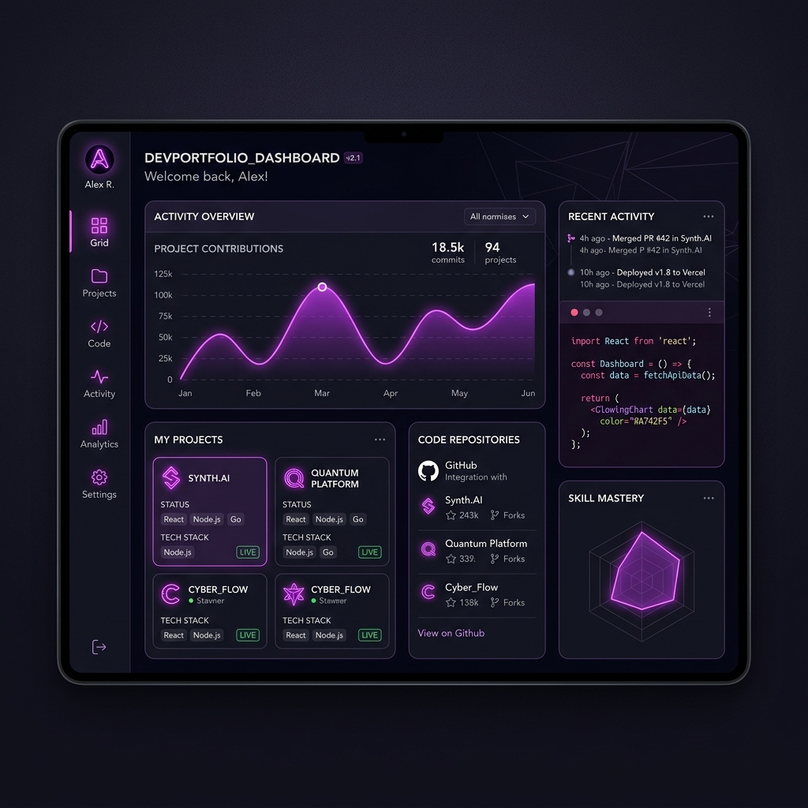

# 🚀 React Learning Journey (May 18 - May 28, 2026)

<p align="center">
  
  
  
  
  
</p>

Welcome to my **React Learning Journey** repository! This project documents my intensive 10-day sprint (May 18, 2026 – May 28, 2026) to master React from scratch. As a B.Tech 3rd-year computer science student, I built this repository to showcase my transition from static web pages to building dynamic, interactive, and optimized React applications.

## 🔗 Live Interactive Dashboard
Instead of just static markdown notes, I have compiled all my practice exercises, daily roadmaps, and mini-projects into a **live interactive developer portfolio dashboard**. 

---

## 📅 The 10-Day Timeline

### [Day 1 — Introduction to React](src/pages/TimelineView.jsx)
* **Concepts:** React history, Virtual DOM, JSX, components architecture, rendering elements, and props.
* **Practice Work:** Set up first component, passed user details as props.

### [Day 2 — React State & Event Handling](src/pages/TimelineView.jsx)
* **Concepts:** State vs Props, `useState` hook, event handler binding, conditional rendering logic.
* **Practice Work:** Multi-step Counter and dynamic theme switcher.

### [Day 3 — Lists, Keys, & Controlled Components](src/pages/TimelineView.jsx)
* **Concepts:** Rendering arrays with `.map()`, React keys, handling user forms, controlled inputs.
* **Practice Work:** Interactive feedback forms, searchable lists.

### [Day 4 — Side Effects & API Fetching](src/pages/TimelineView.jsx)
* **Concepts:** `useEffect` dependencies, fetching APIs with fetch, handling pending/loading states, error boundaries.
* **Practice Work:** Weather API client UI, dynamic profiles fetcher.

### [Day 5 — Client-Side Routing](src/pages/TimelineView.jsx)
* **Concepts:** Single Page App routing, React Router v6 setup, `BrowserRouter`, `Routes`, `Route`, dynamic routing (`useParams`), nested layouts.
* **Practice Work:** Multi-tab learning dashboard, structured routes.

### [Day 6 — Global State & Context API](src/pages/TimelineView.jsx)
* **Concepts:** Prop drilling, state hoisting, building context providers, custom hooks for consuming contexts.
* **Practice Work:** Global dark theme toggle, user session context simulated system.

### [Day 7 — Custom Hooks & Reusability](src/pages/TimelineView.jsx)
* **Concepts:** Extracting stateful logic, custom hook syntax, reusable layout wrappers, cleaner component architecture.
* **Practice Work:** `useLocalStorage`, `useStopwatch` hooks.

### [Day 8 — Performance Optimization](src/pages/TimelineView.jsx)
* **Concepts:** React fiber reconciliation, `React.memo`, `useMemo`, `useCallback`, dynamic code splitting with `React.lazy` and `Suspense`.
* **Practice Work:** Optimized list computation, lazy-loaded subpages.

### [Day 9 — Code Organization & Deployment](src/pages/TimelineView.jsx)
* **Concepts:** Production-ready folder systems, design guidelines, environment setup, Vite production builds.
* **Practice Work:** Portfolio shell organization.

### [Day 10 — Capstone Integration & Polish](src/pages/TimelineView.jsx)
* **Concepts:** Integrating styling systems, custom transitions, animations, portfolio preparation, clean documentation.
* **Practice Work:** Completed Capstone Mini-Projects.

---

## 🛠️ Portfolio Skills Radar

| Skill Category | Mastered Concept | Proficiency |
|---|---|---|
| **Core React** | JSX, Components, Props, Reusability | 🌟 95% |
| **State Management** | Local State (`useState`), Global Context (Context API) | 🌟 90% |
| **Lifecycle & Async** | Side Effects (`useEffect`), REST API Integrations | 🌟 85% |
| **Navigation** | React Router v6, Dynamic Params, Nested Routes | 🌟 85% |
| **Optimization** | Memoization (`useMemo`, `useCallback`), Lazy Loading | 🌟 80% |

---

## 📂 Repository Folder Structure

```bash
src/
├── assets/       # Static graphic items, SVGs & screenshots
├── components/   # Globally reusable UI primitives (GlassCard, CodeBlock, etc.)
├── context/      # Learning dashboard theme/progress stores
├── hooks/        # Reusable custom React hooks
├── practice/     # Interactive sandboxes for 10 exercises
├── projects/     # Deep-dive interactive mini-projects
├── pages/        # Dashboard layout pages (Timeline, Projects, Concepts, etc.)
└── styles/       # System global styling modules & variables
```

---

## 💻 10 Interactive Practice Labs

Here is a summary of the practice exercises developed. You can run all of these inside the interactive portfolio UI!

1. **Counter App**: Basic state management, bounds check (0-100), custom increments.
2. **Todo App (Basic)**: Simple key-driven list renderer with task removal.
3. **Weather App UI**: Sleek mock weather query board showcasing conditional loaders.
4. **Calculator**: Grid structure, event routing, math execution.
5. **Form Validation**: Live error checks, email patterns, password strength meter.
6. **API Fetching**: Simulated delay requests, JSON format viewing, error handling.
7. **Theme Toggle**: In-app theme variables layout adjuster.
8. **Search Filter**: Sub-millisecond client list matching.
9. **Notes App**: Dynamic canvas sticky-notes setup.
10. **Stopwatch**: Precision milliseconds counter using `useRef` and `useEffect`.

---

## 🌟 Capstone Mini-Projects

The repository contains five core mini-projects, demonstrating end-to-end component creation:

### 1. Advanced Todo System
* **Features:** Multiple lists (Work, Personal), due dates, priorities, status analytics charts.
* **Concepts:** Deep state array modifications, client-side persistence.

### 2. Movie Search Application
* **Features:** Search mock movie DB, filter by genre, detailed poster details modal.
* **Concepts:** Controlled inputs, clean card grid styling, modals.

### 3. Weather Dashboard
* **Features:** Search query, multi-day forecast, dynamic animations based on climate conditions.
* **Concepts:** Async API workflows, nested component updates.

### 4. Expense Tracker
* **Features:** Expense list, category tags, interactive monthly summary metrics.
* **Concepts:** Array manipulation, mathematical state aggregates.

### 5. Rich Notes Application
* **Features:** Markdown rendering, side-by-side editing, text folder category logs.
* **Concepts:** Advanced text forms, custom markdown syntax rendering.

---

## ⚠️ Challenges Faced & Solutions

* **Challenge:** *Understanding `useEffect` cleanup operations.*
  * **Solution:** Documented how standard event listeners and timers cause memory leaks if not cleared, and how the return callback solves this.
* **Challenge:** *Prop Drilling vs Context API.*
  * **Solution:** Experienced the difficulty of passing state down 4 levels in practice app, refactored it into Context API to establish a clean state source.
* **Challenge:** *Maintaining performance on large dynamic tables.*
  * **Solution:** Applied `useMemo` to filter processes, preventing redundant computations on input change.

---

## 📈 Future Milestones

* [ ] Deepen knowledge of Server Components & Next.js Framework.
* [ ] Integrate Backend servers (Express.js, Node.js) and Databases (MongoDB).
* [ ] Explore state management libraries (Zustand / Redux Toolkit).
* [ ] Contribute to active open-source React projects on GitHub.

---

## 🎨 Visual Preview (Live Application)

<p align="center">
  <em>(Interactive App Screen)</em><br/>
  
</p>

---

## 🤝 Connect with Me

* **GitHub:** [@yourusername](https://github.com/yourusername)
* **LinkedIn:** [Your Name](https://linkedin.com/in/yourname)
* **Email:** [your.email@example.com](mailto:your.email@example.com)

---

> "The best way to predict the future is to invent it. React is the first step in my full-stack journey." 💻🔥
